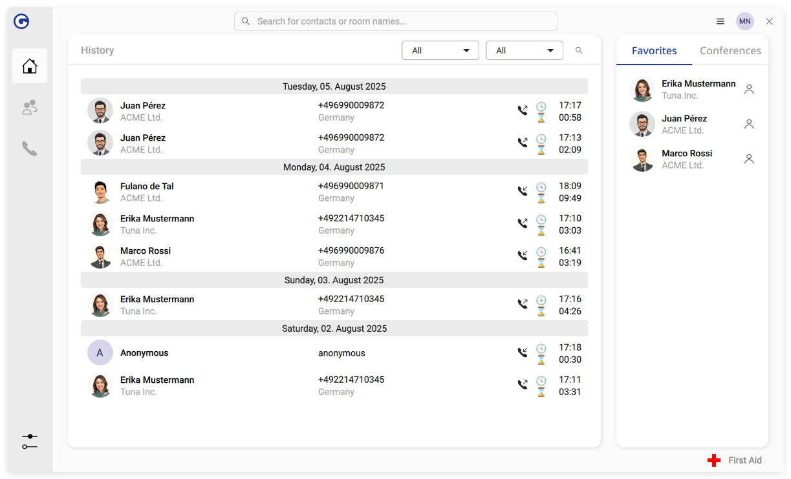

<p align="center">
  
</p>

<p align="center">
  <a href="https://github.com/gonicus/gonnect/wiki">Documentation</a> |
  <a href="https://github.com/gonicus/gonnect/issues">Issues</a> |
  <a href="https://flathub.org/apps/de.gonicus.gonnect">Install</a>
</p>

---
[](https://github.com/gonicus/gonnect/actions/workflows/gonnect.yml) [](https://flathub.org/apps/de.gonicus.gonnect) [](https://hosted.weblate.org/engage/gonnect/)

# Overview

_GOnnect_ is an opinionated, simple, easy to use VoIP client, designed for
Linux / _Flatpak_ based installations. It makes use of various Flatpak
portals and is meant to integrate well into modern Desktop Environments
like _KDE_ or _GNOME_.



What is special about _GOnnect_ is that is meant to be provisioned. For
that reason it has no configuration wizard or settings dialog and
requires a working configuration file in place.

Here's a short feature list:

 * Call forwarding
 * Conference calls with three parties
 * Busy state for supported sources
 * Configurable busy on active call
 * LDAP/CardDAV address sources
 * Configurable identities for outgoing calls
 * Configurable Togglers (i.e. for call queues, CFNL, etc.)
 * Upgrade call to Jitsi Meet session
 * Support for various hardware headsets (i.e. Yealink, Jabra)
 * Support for various busylights
 * Custom audio device profiles or managed by your system
 * [mpris](https://specifications.freedesktop.org/mpris-spec/latest/) for
   stopping other audio sources on incoming calls
 * System Tray integration for most common functions / favorites / most frequent
   calls
 * GNOME Search-Provider support
 * KRunner search plugin (requires next generation flatpak)
 * Desktop Actions / Autostart
 * Global Keyboard Shortcuts (if supported by your Desktop environment)
 * Keeping the screensaver from droppin' in while on the phone
 * Mime-Type registration for `tel:` / `sip:` URLs
 * Light/Dark mode

# Headsets known to be supported

GOnnect supports some generic USB headset features to make your calls easier.
Here is the current list in combination

| Feature                                  | Key |
| ---------------------------------------- | --- |
| Answering the call via handset off-hook  | A   |
| End call by hanging up the handset       | E   |
| Mute control                             | M   |
| LED state visualization                  | S   |
| Busy light support (additional hardware) | L   |
| Open GOnnect via handset off-hook        | O   |
| Ringing via headset base station         | R   |

In theory, Teams certified Headsets may work, but you never know... Here is a
list of tested headsets. Please feel free to report any working combinations to
make this list more complete by opening an [issue](https://github.com/gonicus/gonnect/issues).

| Manufacturer     | Model               | Features        |
| ---------------- | ------------------- | --------------- |
| Jabra            | EVOLVE LINK         | AEMSO           |
| Plantronics/Poly | Voyager Focus BT600 | AEMSO           |
| Poly             | Blackwire C5220     | AEMSO           |
| Sennheiser       | SC 660 ANC USB      | AEM             |
| Yealink          | WH62                | AEMSLOR         |

# Busylights known to be supported

| Manufacturer | Model              |
| ------------ | ------------------ |
| kuando       | Busylight UC Omega |
| Logitech G   | Litra Beam LX      |
| Luxafor      | Flag               |

# Installing _GOnnect_

_GOnnect_ is distributed via Flathub only. To install it, either visit the
[Flathub page](https://flathub.org/apps/de.gonicus.gonnect), search for _GOnnect_ in _GNOME-Software_
or KDE's _discover_.

After you have installed _GOnnect_, either adjust the provided
`sample.conf` and place it in `~/.var/app/de.gonicus.gonnect/config/gonnect/99-user.conf`,
or head over to [the documentation](https://github.com/gonicus/gonnect/wiki).

# Non-goals

Like every other software, _GOnnect_ cannot be an all-purpose silver bullet. Here are some 
deliberately chosen non-goals, so things that will not be implemented into _GOnnect_:

* **Full SIP configuration**: Most SIP clients provide a plethora of options to configure
every single bit of the SIP connection. That includes many audio codecs of which most are 
obsolete or rarely used. _GOnnect_ strives to be simple and therefore allows only the most
common and important options. This will exclude some exotic ones.
* **PIM/contact management**: This should be done via dedicated PIM services as opposed to 
implementing the nth place to store contacts.
* **Speech-to-text transcription and audio recording**: Apart from some technical insufficiencies
this bears some critical questions about data privacy. 
* **Conferences with more than three participants**: Ad-hoc conferences are implemented such
that the initializing participant will be a router for the audio streams of the others. In
our experience, having more than three endpoints will produce bad sound quality, delays and
other performance issues. Bigger conferences would require a specific configuration on the 
SIP server or another platform (like [Jitsi Meet](https://meet.jit.si/)).

# Development

_GOnnect_ is based on Qt / C++ and requires a set of libraries to be buildable.
There are may ways to achieve a build, but we'll describe just one of them in
the following paragraphs.

## Prerequisites

As we use immutable desktops here at [GONICUS](https://www.gonicus.de) and
development takes place in a dedicated
[distrobox](https://github.com/89luca89/distrobox) for each project, we also use
this procedure for _GOnnect_.

Make sure to have _distrobox_ installed. On _Fedora_ for example run:

```bash
sudo dnf install distrobox
```

After _distrobox_ is installed, create the _distrobox_ for _GOnnect_ development
by running

```bash
distrobox assemble create
```

in the directory of your _GOnnect_ checkout.


## Building 

Assuming you're using the documented _distrobox_ approach above, enter the _distrobox_
and start the ordinary _CMake_ build:

```bash
distrobox enter gonnect
cmake --workflow --preset --default
```

Alternatively you can simply run `qtcreator` inside the _distrobox_ and open the
project as usual be selecting the `CMakeLists.txt`.


## Building the flatpak

As _GOnnect_ is mainly developed for use in _Flatpak_, some features only work in this
kind of environment. If you want to build the _Flatpak_ locally, you can do this by
the following commands on your host shell:

```bash
flatpak uninstall de.gonicus.gonnect
flatpak run --command=flatpak-builder org.flatpak.Builder build --user --install-deps-from=flathub --disable-rofiles-fuse --force-clean --repo=repo resources/flatpak/de.gonicus.gonnect.yml
flatpak --user remote-add --no-gpg-verify gonnect-repo repo
flatpak --user install gonnect-repo de.gonicus.gonnect
```

# License

_GOnnect_ is licensed unter the terms of the GNU GENERAL PUBLIC LICENSE
Version 2, or at your opinion any later version.

See [LICENSE](LICENSE) for the full content of the license.

